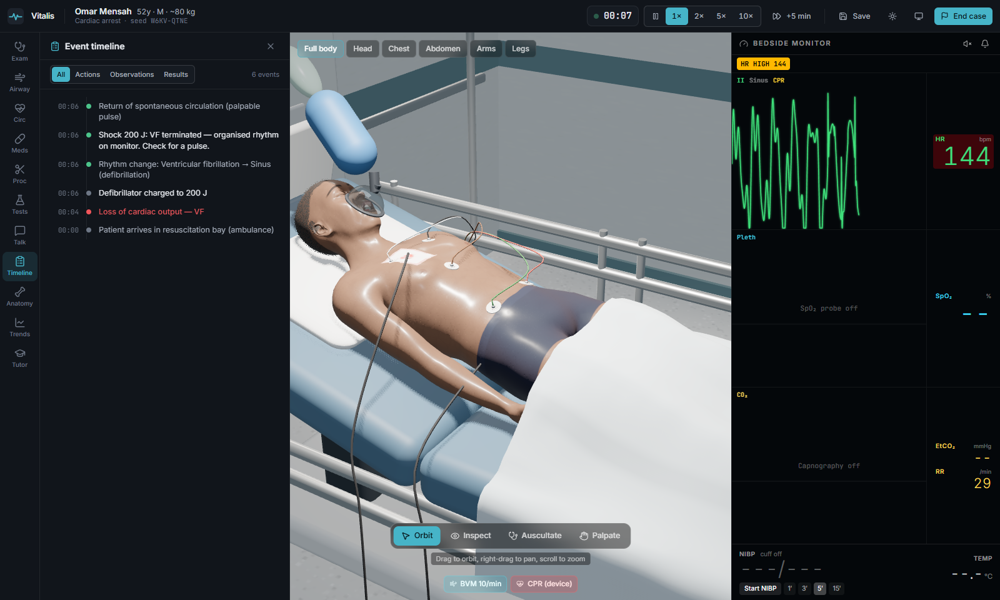
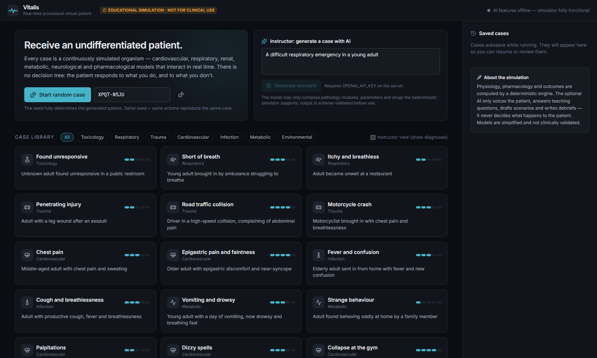
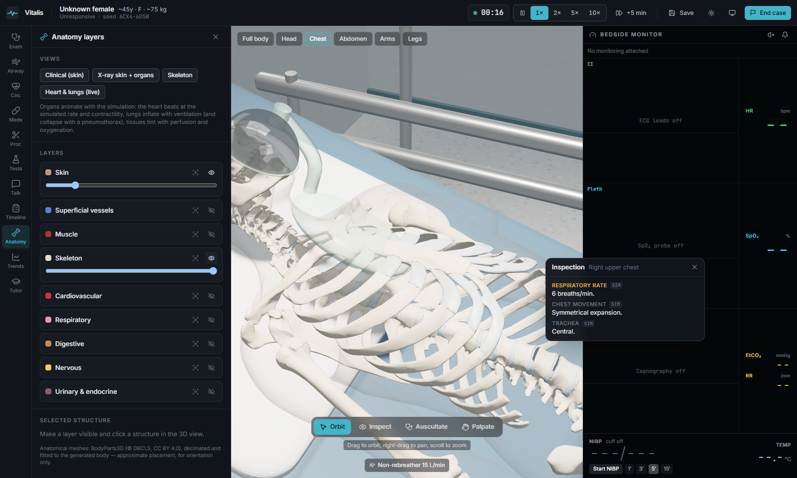
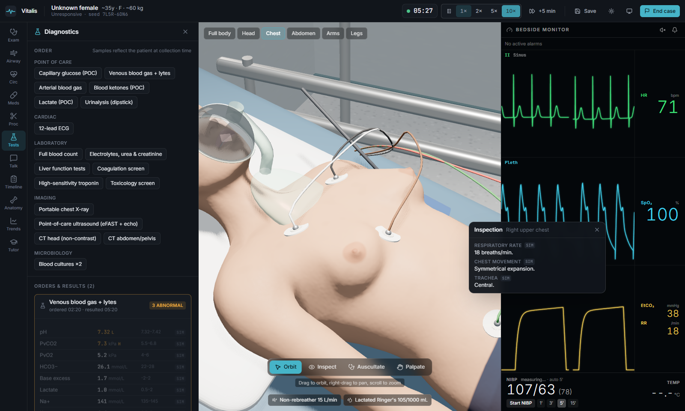
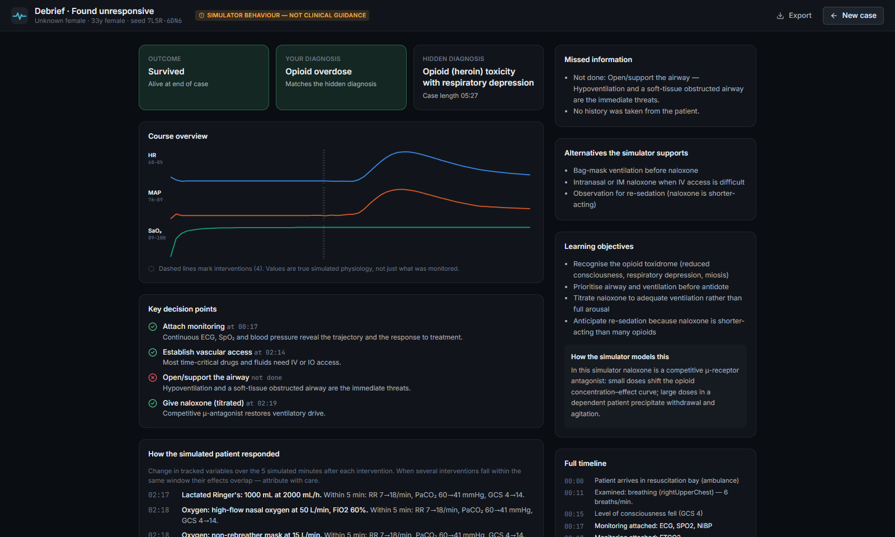
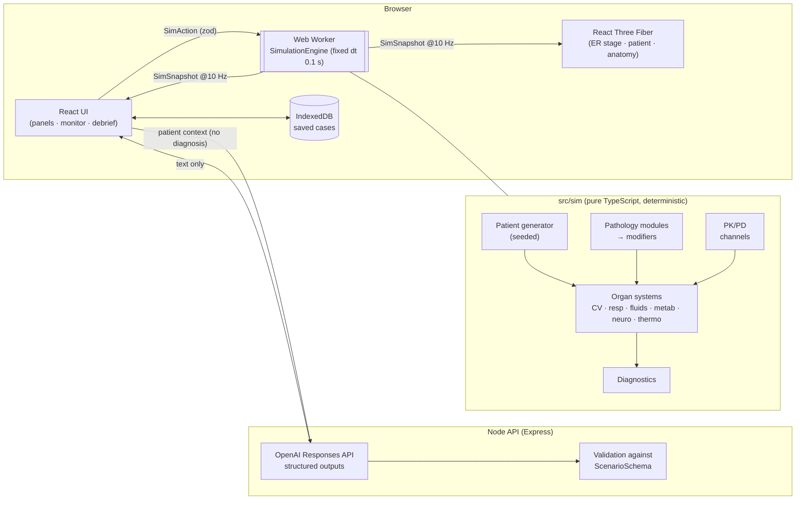

# Vitalis — Real-Time Procedural 3D Human Medical Simulator

> ⚠️ **Educational simulation only.** Vitalis is a teaching tool. It is **not** a medical device and **not** clinical decision support, and its physiology has not been clinically validated. Do not use it to make decisions about real patients.

Vitalis puts you in an emergency room with a procedurally generated 3D patient whose body is **continuously simulated**: circulation, lungs, blood gases, fluids, kidneys, metabolism, temperature, nervous system and pharmacology. You do not choose from a decision tree. You examine, monitor, test and treat, and the physiology responds. The diagnosis is hidden until the debrief.



| Start screen | Anatomy layers | Results | Debrief |
|---|---|---|---|
|  |  |  |  |

## What it does

- **Procedural patients.** A seed generates a person with demographics, body shape, history, medications, allergies, social history and their own baseline physiology. The same seed always produces the same patient and course.
- **Continuous physiology.** A deterministic engine runs at 10 Hz in a Web Worker at 0×, 1×, 2×, 5× or 10× speed:
  - two-sided Guyton circulation with Frank–Starling ventricles and coronary territories;
  - a rhythm state machine;
  - lung mechanics, chemical control and an O₂/CO₂ gas-exchange model;
  - Starling fluid compartments, kidneys and coagulation;
  - glucose, insulin and acid–base;
  - thermoregulation and consciousness/GCS.

  See [docs/PHYSIOLOGY.md](docs/PHYSIOLOGY.md).
- **Real PK/PD.** About 50 drugs and blood products. Each has compartments, an effect site, route-dependent absorption (IM absorption is slow in shock), receptor channels with synergy and competitive antagonism, allergies, and endogenous catecholamine tone.
- **Composable pathology.** Scenarios combine 14 mechanistic modules: haemorrhage, anaphylaxis, asthma, opioid toxicity, sepsis, hypoglycaemia, DKA, dehydration, tension pneumothorax, myocardial ischaemia, arrhythmias, cardiac arrest, hyperkalaemia and hypothermia. The period before arrival is *simulated*, so the patient arrives in a computed state, not an authored one.
- **3D patient.** A MakeHuman-based character on an ER bed, shaped by the patient's age, sex, weight, height and skin tone. Breathing, chest asymmetry, cyanosis, pallor, sweat, urticaria, facial expression, CPR compression and every attached device follow the simulation. Anatomy layers (skeleton, organs, cardiovascular, respiratory, muscle, nervous) can be shown, hidden, made transparent, isolated or selected, and the heart and lungs move with the physiology.
- **Clinical interaction:**
  - **Examination:** inspection, palpation, pupils and GCS, and **auscultation with audio** for heart and lung sounds, wheeze, crackles, stridor and absent breath sounds.
  - **Airway and breathing:** manoeuvres and adjuncts, suction, O₂ devices, bag-valve mask, RSI and intubation, a ventilator, and a surgical airway.
  - **Circulation:** IV/IO access, fluids and blood (optionally warmed), drug boluses and infusions, and CPR with a rhythm/depth input.
  - **Defibrillation and procedures:** defibrillation, synchronised cardioversion and pacing; needle or tube thoracostomy; tourniquet, pelvic binder and haemostasis; reperfusion, dialysis and warming.
  - **Diagnostics:** tests have realistic collection and turnaround times, and every result is labelled *simulated* or *authored*.
- **Bedside monitor.** ECG, pleth and capnography waveforms are synthesised from the simulated state. The monitor also shows NIBP cycles, an arterial line and alarms with sound. Every channel requires its sensor to be attached.
- **AI (optional; server-side OpenAI).**
  - An AI patient that talks within their physiological limits (full sentences, phrases, words or silence) and never reveals the diagnosis.
  - A Socratic tutor.
  - Scenario generation constrained to, and validated by, the simulator's own schema.
  - A narrative debrief.

  Everything has an offline fallback. **The AI can never change physiology.**
- **Debrief.** The debrief shows the event timeline, trends, key decisions and their measured physiological response, missed actions, harms, alternatives, the hidden diagnosis and learning objectives.
- **Persistence.** Cases autosave to IndexedDB and resume after a reload. Cases can also be replayed from `seed + actions`.

## Architecture



Details: [docs/ARCHITECTURE.md](docs/ARCHITECTURE.md), which covers the engine research, the data flow, determinism, the plan for swapping in the Pulse Physiology Engine, AI boundaries and the 3D pipeline.

## Technology

### Web3D frameworks

| Layer | Used for |
|---|---|
| **Three.js** (WebGL 2) | All 3D rendering: skinned human mesh, morph targets, anatomy meshes, custom skin and eye shaders |
| **React Three Fiber** | Declarative scene graph and render loop inside React |
| **Drei** | Camera controls and scene helpers |
| **glTF 2.0** (meshopt-compressed) | Anatomy layers, loaded on demand |
| **Web Workers** | The physiology engine runs off the main thread, so rendering stays smooth |
| **Web Audio API** | Synthesised heart sounds, breath sounds and monitor tones |

The human body is built at runtime from MakeHuman data (base mesh, skeleton, skin weights and morph targets).

### AI models

| Feature | Model (default) | How it is constrained |
|---|---|---|
| Patient conversation | `gpt-5.4-mini` (`OPENAI_FAST_MODEL`) | Sees only what the patient could know or feel; never the diagnosis |
| Tutor hints | `gpt-5.5` (`OPENAI_MODEL`) | Sees only what the learner has observed; told not to reveal the diagnosis |
| Case generation | `gpt-5.5` | Output must pass the simulator's own case validator; up to 3 repair attempts |
| Narrative debrief | `gpt-5.5` | Grounded in the case's event log and recorded physiology |

All calls go through the OpenAI Responses API with strict structured outputs, from the Node server. The models produce text only and cannot change the simulation. No model is involved in the physiology, which is fully deterministic.

### Deployment

Live demo: https://medical.pafodev.com

The whole application runs from one Node process, which serves the built front end and the AI endpoints on the same origin:

```bash
npm ci
npm run build
OPENAI_API_KEY=... PORT=8787 npm start
```

Put it behind any reverse proxy with HTTPS. The front end is also a plain static site (`dist/`), so it can be served from a static host on its own; in that case every AI feature uses its scripted fallback and the rest of the simulator works in full. Two build-time options cover split hosting: `VITE_BASE` for a sub-path, and `VITE_API_BASE` for an API on another origin (set `ALLOWED_ORIGIN` on the server to match).

See also the [innovation statement](docs/INNOVATION.md).

## Getting started

Requirements: **Node ≥ 20.12** (tested on 22) and a WebGL2-capable browser.

```bash
npm install
cp .env.example .env         # optional: add OPENAI_API_KEY for AI features
npm run dev                  # API on :8787 + Vite on :5173 (proxied /api)
```

Open http://localhost:5173. Choose a case from the library or press **Start random case**, read the paramedic handover, and receive the patient.

Production:

```bash
npm run build
npm start                    # Express serves dist/ and /api on $PORT (default 8787)
```

### Environment variables (server only)

| Variable | Default | Purpose |
|---|---|---|
| `OPENAI_API_KEY` | — | Enables AI patient, tutor, scenario generator and narrative debrief. Without it the app uses deterministic fallbacks. |
| `OPENAI_MODEL` | `gpt-5.5` | Scenario generation, tutor, debrief |
| `OPENAI_FAST_MODEL` | `gpt-5.4-mini` | Low-latency patient dialogue |
| `PORT` | `8787` | API/production server port |

The key is read only by the Node server (`server/`). Nothing is prefixed with `VITE_`, and the browser calls `/api/ai/*`. Requests are rate-limited, and every model output is parsed with a zod structured-output schema before use.

## Using the simulator

1. Read the **handoff**. Vitals are not shown until you attach monitoring from the Circulation panel or the monitor.
2. Use the **rail** on the left to open the panels:
   - Exam, Airway, Circulation, Meds, Procedures, Tests and Talk;
   - Timeline, Anatomy, Trends and Tutor.
3. In the 3D view, choose a tool:
   - **Orbit**, or **Inspect** to click a body region and see findings;
   - **Auscultate**, to click on the chest or back and listen;
   - **Palpate**.
4. Camera presets are at the top left. The speed controls and **+5 min** are in the top bar.
5. Press **End case** and state your working diagnosis to see the debrief.

Keyboard: `1`–`9` toggle the panels and `Esc` closes them. During manual CPR, tap `Space` in time with compressions; the rate and rhythm of your taps set CPR quality.

## Scripts

| Command | What it does |
|---|---|
| `npm run dev` | API + Vite dev servers |
| `npm run build` | Type-check (project references) and production build |
| `npm run typecheck` / `npm run lint` | TypeScript / ESLint |
| `npm test` | Vitest unit/integration tests (engine determinism, invariants, interventions, pharmacology, scenarios, AI schemas, save/load) |
| `npm run test:e2e` | Playwright end-to-end workflows (desktop + tablet), builds a preview and starts the API automatically |
| `npx tsx scripts/trace.ts <scenario> [seed]` | Print a physiology trace for tuning |
| `npm run assets` | Rebuild the human and anatomy assets from source downloads (see ASSETS.md) |

## Demo video and project brief

- `docs/Vitalis-Project-Brief.pdf` is a two-page summary: how the simulator is used, its core features, and the hardest parts of the build. Regenerate it with `node scripts/make-brief.mjs`.
- `video/out/vitalis-demo.mp4` is a 4¾-minute walkthrough of a full case. To rebuild it:
  1. Start the app (`npm run build && npm start`).
  2. Record the clips: `node scripts/record-demo.mjs`. This drives the real interface with Playwright and encodes each segment with ffmpeg (ffmpeg must be on the PATH).
  3. Render the edit: `cd video && npm install && npm run render`. The edit is a Remotion project; cuts and captions live in `video/src/timeline.ts`.
- `node scripts/make-submission.mjs --url "<download link>" --authors "<names>"` builds `submission/Vitalis-submission.zip` and a cover PDF carrying the link and the zip's MD5.

## Supported content

**Scenarios (19):**

1. Found unresponsive
2. Short of breath
3. Itchy and breathless
4. Penetrating injury
5. Road traffic collision
6. Motorcycle crash
7. Chest pain
8. Epigastric pain and faintness
9. Fever and confusion
10. Cough and breathlessness
11. Vomiting and drowsy
12. Strange behaviour
13. Palpitations
14. Dizzy spells
15. Collapse at the gym
16. Weak and nauseous
17. Diarrhoea and vomiting
18. Found outdoors
19. Breathless and fluttery

AI-generated scenarios (from the start screen) use the same modules and must pass the same validator.

**Drugs:**

| Group | Drugs |
|---|---|
| Vasoactive and inotropes | adrenaline, noradrenaline, phenylephrine, vasopressin, dobutamine, isoprenaline |
| Antiarrhythmics and rate control | adenosine, amiodarone, diltiazem, metoprolol, atropine |
| Analgesia, sedation and induction | morphine, fentanyl, ketamine, midazolam, lorazepam, propofol |
| Neuromuscular blockers | rocuronium, suxamethonium |
| Reversal | naloxone |
| Respiratory | salbutamol, ipratropium, magnesium |
| Steroids and antihistamine | hydrocortisone, methylprednisolone, diphenhydramine |
| Symptom relief | ondansetron, paracetamol |
| Antiplatelet, anticoagulant and nitrate | aspirin, GTN, heparin |
| Thrombolytic and antifibrinolytic | tenecteplase, tranexamic acid |
| Diuretic | furosemide |
| Glucose and insulin | dextrose 50 %/10 %, glucose gel, glucagon, insulin |
| Electrolytes | KCl, calcium gluconate/chloride, sodium bicarbonate |
| Antibiotics | ceftriaxone, piperacillin–tazobactam, meropenem, vancomycin |

**Fluids and blood:** 0.9 % saline, Hartmann's/LR, Plasma-Lyte, 5 % dextrose, 5 % albumin, PRBC, FFP, platelets, whole blood.

**Tests:**

- Point-of-care: capillary glucose, VBG, ABG, ketones, lactate, urinalysis.
- Laboratory: FBC, U&E, LFT, coagulation, hs-troponin, toxicology, blood cultures.
- ECG and imaging: 12-lead ECG, portable CXR, POCUS (eFAST + echo), CT head and CT abdomen.

## Assets and licences

- Human body: **MakeHuman** base mesh, skeleton and targets (CC0).
- Anatomy: **BodyParts3D**, © The Database Center for Life Science, licensed under CC Attribution 4.0 International. The original file headers say CC BY-SA 2.1 JP, so the derived meshes in `public/assets/anatomy/` are distributed with attribution under share-alike terms as a precaution. Application code is unaffected.
- Hair, skin, eyebrows and underwear are generated procedurally in shaders, because the only available MakeHuman hair and skin assets are AGPL-licensed.
- Fonts: Inter and JetBrains Mono (OFL).
- Sounds: synthesised at runtime with the Web Audio API.

See [ASSETS.md](ASSETS.md) for sources, processing and attribution.

## Limitations

- Physiology is simplified and lumped. The waveforms are synthesised, and several conditions are not modelled (PE, tamponade, stroke, dissection, burns, most toxidromes). See [§14 of PHYSIOLOGY.md](docs/PHYSIOLOGY.md#14-known-limitations).
- Adults only. Pregnancy and paediatrics are not supported.
- The 3D character has short procedural hair and shader-based skin rather than photographic textures. The lung, myocardium and spinal-cord surfaces are derived meshes, because the source dataset does not contain them.
- Anatomy meshes are fitted to the generated body approximately, not per-patient.
- AI dialogue quality depends on the model. Offline fallbacks are scripted and limited.
- Timing and treatment responses follow current resuscitation guidance only broadly, and are not a substitute for local protocols.

## Future work

- A Pulse Physiology Engine backend behind the existing `PhysiologyEngine` interface.
- Multi-user team mode with roles, and an instructor console for live scenario injection.
- More pathology modules (PE, tamponade, raised ICP, burns, toxidromes), paediatric physiology, and a pressure–volume-loop heart.
- Server-side case storage, cohort analytics and LTI integration.
