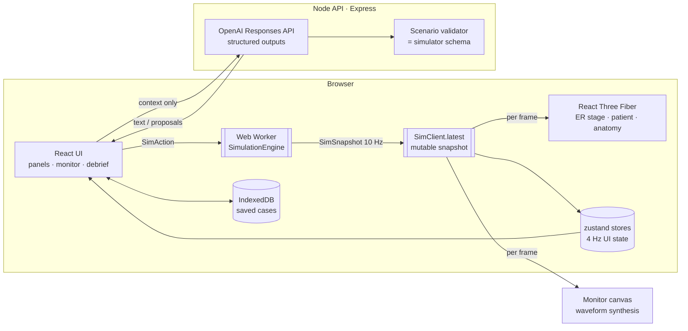

# Vitalis — Architecture

> **Educational simulator. Not a clinical decision-support tool.** Physiology is simplified and has not been clinically validated.

## 1. Guiding principle

The student interacts with a *continuously simulated organism*, not a decision tree. Every visible thing — vital signs, waveforms, the 3D character's breathing and colour, examination findings, laboratory values, the patient's ability to talk — is **derived from simulated state**. Interventions enter the simulation as actions and change that state through modelled mechanisms (pharmacokinetics/dynamics, haemodynamics, gas exchange, fluid shifts). The AI layer produces language only.

```
Patient definition (seeded) ─┐
Scenario (pathology modules)─┼─► Physiology simulation ─► State ─► monitor · 3D body · exam · labs · AI context
Clinician actions ───────────┘          ▲                                     │
                                        └────────── consequences ◄────────────┘
```

## 2. Physiology engine decision (Phase 1 research)

| Engine | Scope | Licence | Integration path | Verdict for this prototype |
|---|---|---|---|---|
| **Pulse Physiology Engine** (Kitware) | Whole-body, validated against literature; large action/drug library (hemorrhage, tension PTX, anaphylaxis, airway obstruction, bronchoconstriction, drugs with PK/PD, ventilators) | Apache-2.0 | C++ with C#, Java and Python bindings; no official pip wheel or WebAssembly build; build requires CMake + a C++ toolchain; the `pulse-engine` package on PyPI is an unrelated project | **Best long-term backend.** Not directly usable here: no toolchain available in this environment, no browser build. Architected as a drop-in replacement (§5). |
| **BioGears** (ARA) | Pulse's ancestor; similar breadth | Apache-2.0 | C++; heavy build; less active | Same constraints; Pulse supersedes it. |
| **HumMod** | Very large Guyton-derived model (thousands of variables) | GPL/academic | Java + XML model; research-oriented, not an interactive game loop | Excellent reference; not practical for real-time embedded interaction or licensing reasons. |
| Others (e.g. the Guyton 1972 model, BioGears-JS forks, Physiome/CellML models) | Organ-level | varies | Hand-porting | Used as **references** for equations. |

**Decision:** implement a deterministic, modular TypeScript engine (`vitalis-ts`) that runs in a Web Worker, grounded in established lumped-parameter physiology (Guyton venous return, Frank–Starling, Severinghaus/Kelman O₂ dissociation, Starling–Landis capillary exchange, compartmental PK with effect-site equilibration, sigmoid Emax PD with Minto-type interaction). It is hidden behind a `PhysiologyEngine` interface so a Pulse-backed service can replace it. Its limitations are documented in [`PHYSIOLOGY.md`](PHYSIOLOGY.md); it makes **no claim of clinical fidelity**.

## 3. System overview



### Separation of concepts

| Concept | Where | Notes |
|---|---|---|
| `PatientDefinition` | `src/sim/patient/generator.ts` | Seeded; demographics → history → derived baseline physiology |
| `ScenarioDefinition` | `src/sim/scenarios/schema.ts`, `library.ts` | Data only; composes pathology modules; zod-validated |
| `PhysiologyState` | `src/sim/types.ts` | cv, resp, blood, fluids, chem, renal, neuro, thermo, metab, infl |
| `SimulationEngine` | `src/sim/engine/SimulationEngine.ts` | Fixed-step orchestrator; implements `PhysiologyEngine` |
| `PharmacologyEngine` | `src/sim/pharmacology/pkpd.ts` | Depots, 2-compartment PK, ke0, channels |
| `Intervention` | `src/sim/interventions/actions.ts`, `handlers.ts` | zod `SimAction` union; handlers change *therapy state* |
| `DiagnosticTest` | `src/sim/diagnostics/orders.ts` | Sample captured at collection; turnaround; provenance tags |
| `SimulationEvent` | `src/sim/types.ts`, `engine/detectors.ts` | Timeline; hysteresis-based physiology events |
| `AnatomyState` | `src/three/types.ts` (`AnatomyLayerSettings`, overlays) | Renderer-side |
| `AnimationState` | `AvatarVisualState` in `src/three/types.ts`; filled by `src/client/visualState.ts` | The only interface between physiology and the 3D character |
| `AIContext` | `src/client/aiContext.ts` | What the patient knows/feels; never the diagnosis |
| `Debrief` | `src/sim/debrief/analyze.ts` (+ optional AI narrative) | Reconstructed from the event log and history |

## 4. Simulation loop

- **Fixed timestep** `dt = 0.1 s` (pre-arrival roll-in uses 0.25–2 s with internal sub-stepping for the circulation).
- The worker accumulates wall time × speed (0×, 1×, 2×, 5×, 10×) and steps the engine; rendering is independent.
- Snapshots (~6–10 kB) are posted at 10 Hz. React panels re-render at ≤ 4 Hz; the monitor canvas and 3D scene read the latest snapshot inside `requestAnimationFrame` without React renders.
- **Pipeline per tick:** apply queued actions → pending procedures & NIBP → PK step → receptor channels (drugs + endogenous sympathetic/adrenal tone) → pathology modules write *modifiers* → fluids/renal → autonomic → respiratory mechanics & pleura → circulation & coronary → gas exchange → metabolism/acid–base → thermoregulation → neuro → rhythm hazards → diagnostics → event detectors → history.
- **Pre-arrival roll-in:** each scenario pathology has `onsetMinutesBeforeArrival`; the engine simulates that period before t = 0, so the arrival state is *computed*, not authored. Stochastic rhythm transitions are not sampled during roll-in so the case arrives as designed.

### Determinism

All randomness (patient generation, arrhythmia hazards, defibrillation success, IV success, lab analytical noise, behaviour) comes from named `sfc32` streams seeded from the case seed; their state is part of the serialisable engine state. `Math.random()` is never used in `src/sim`. `SimulationEngine.replay(seed, scenario, actionLog)` reproduces a run exactly (tested).

## 5. Replacing the engine (Pulse integration path)

`PhysiologyEngine` (`src/sim/engine/PhysiologyEngine.ts`) is the seam. A Pulse adapter would:

1. Run Pulse (Python API) in a simulation service: `POST /sim` creates an engine from a Pulse patient file generated from `PatientDefinition`; a WebSocket streams data requests at 10 Hz.
2. Map `SimAction` → Pulse actions, e.g. `drug.bolus` → `SESubstanceBolus`, `drug.infusion` → `SESubstanceInfusion`, `fluid.start` → `SESubstanceCompoundInfusion`, `oxygen.set` → `SENasalCannula`/`SESimpleMask`/`SENonRebreatherMask`, `ventilator.set` → `SEMechanicalVentilatorVolumeControl`, `procedure.needleDecompression` → `SENeedleDecompression`, `procedure.chestTube` → `SEChestOcclusiveDressing`/drain, `cpr.*` → `SEChestCompression*`, pathology modules → `SEHemorrhage`, `SETensionPneumothorax`, `SEAirwayObstruction`, `SEBronchoconstriction`, `SEAcuteMyocardialInfarction`, `SESepsis`…
3. Map Pulse data requests → `SimSnapshot` (`phys.cv.*`, `phys.resp.*`, …). Fields Pulse does not provide keep the TypeScript derivations (e.g. appearance, exam text).

The UI, 3D layer, AI layer and diagnostics consume only `SimSnapshot`/`SimAction`, so they are unaffected.

## 6. AI boundaries

- Server-side only (`server/`); the OpenAI key never reaches the browser bundle.
- Responses API with strict **structured outputs** (`zodTextFormat`) for patient replies, tutor answers, scenario drafts and debriefs; every response is re-validated.
- The AI **cannot mutate state**: it has no tools, and its outputs are rendered as text. Scenario drafts are converted and validated against the simulator's own `ScenarioSchema`; invalid drafts are returned to the model with the errors (≤ 3 attempts) and otherwise rejected.
- The patient context contains subjective state (e.g. "can speak in short phrases", "pain 7/10 in the chest") derived from physiology, plus what the patient knows — never the hidden diagnosis or the pathology modules.
- Without `OPENAI_API_KEY` every AI feature degrades gracefully (scripted patient, offline tutor hints, deterministic debrief).

## 7. 3D layer

- **Human:** MakeHuman CC0 base mesh with its CC0 skeleton, weights and morph targets. The per-patient body (sex, age, weight, muscle, height, skin tone) is baked on the CPU from the macro targets, joints are re-derived from helper geometry, and the skinned mesh is posed supine. Runtime morphs: breathing (left/right chest, abdomen), CPR compression and facial expression units.
- **Skin:** physically based material with shader uniforms for pallor, central/peripheral cyanosis, flushing, urticaria, mottling, diaphoresis and angioedema, all driven by the simulation.
- **Anatomy:** 191 BodyParts3D structures in 8 layers (CC BY 4.0; derived meshes treated as share-alike, see ASSETS.md), decimated per layer, loaded when a layer is first shown, fitted to each generated body with landmark-based transforms, attached to bones, and animated by physiology overlays (heart rate/contractility, per-side lung inflation, ischaemia/perfusion tints).
- **Props:** monitoring leads, cannulae, oxygen devices, bag-valve mask, ETT, pads, tourniquet, drains and IV bags reflect the therapy state.
- The whole layer depends only on `src/three/types.ts`, so the character or anatomy assets can be replaced without touching simulation code.

## 8. Persistence

`CaseRepository` (`src/client/persistence.ts`) with an IndexedDB implementation stores the full serialised engine state plus chat and debrief. Autosave runs every 20 s and on page hide; a browser reload resumes the open case paused. The same interface can be backed by a server database (`/api/cases`). Replays use `seed + scenario + actionLog`.

## 9. Error handling

- The worker reports errors as messages; the UI shows toasts and keeps running.
- The 3D stage has an error boundary and a textual fallback; the simulation, monitor and panels do not depend on WebGL.
- AI failures (not configured, timeouts, rate limits, invalid structured output) return `{ ok: false }` and the client falls back.
- Invalid actions are rejected by zod and never reach the engine.
